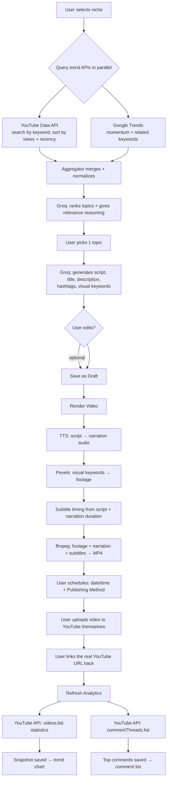
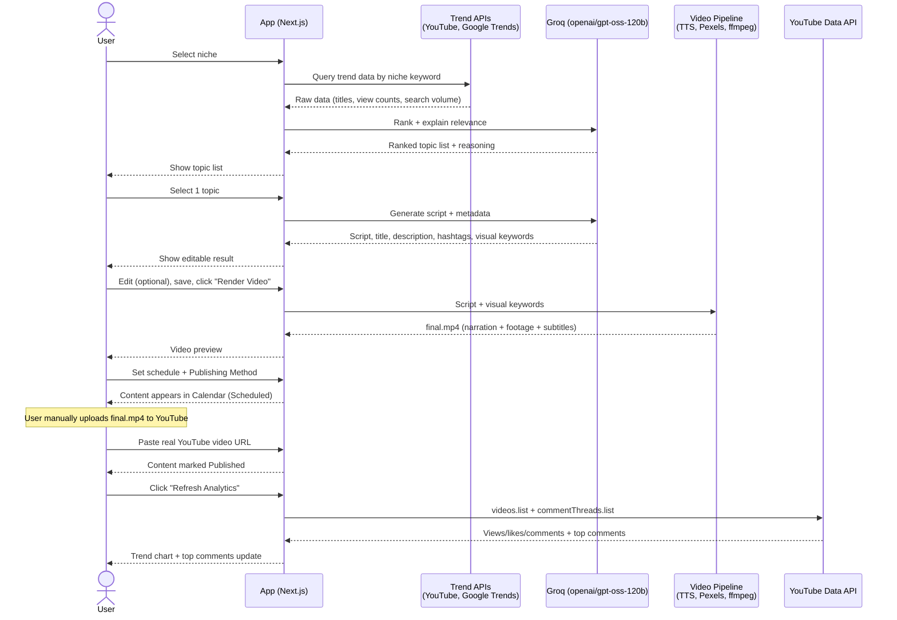
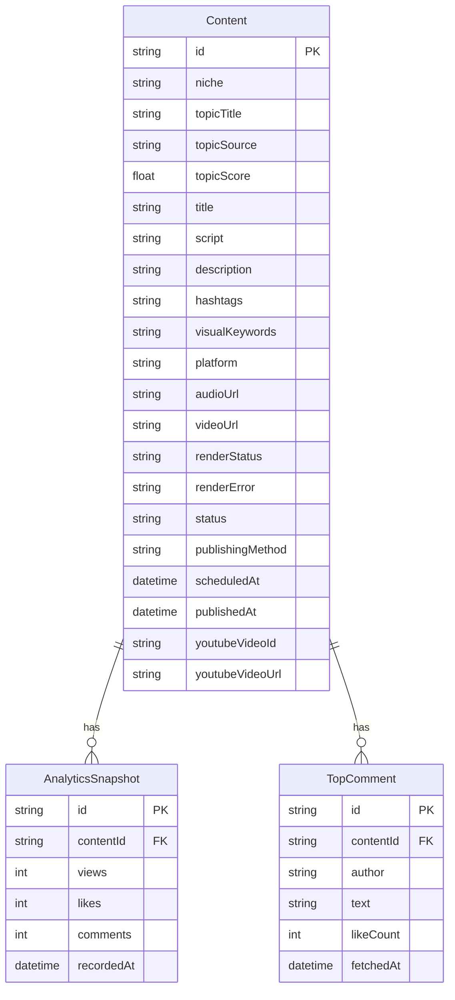

# Viralize

**AI-powered content automation, end to end — from "what's trending" to a real, published video with real analytics.**

Pick a niche → AI discovers what's actually trending in it → AI generates a full script and metadata → the app renders an actual short video (narration + stock footage + burned-in subtitles) → you schedule and publish it → the app tracks its **real** performance on YouTube over time.

Built for the Social Media Automation Hackathon. Every stage in this pipeline calls a real external API and produces real output — there is no "demo data" fallback standing in for the actual feature, with one clearly-labeled exception (see [What's real vs. simulated](#whats-real-vs-simulated)).

---

## Table of contents

- [Overview](#overview)
- [Key features](#key-features)
- [Architecture](#architecture)
  - [System pipeline](#system-pipeline)
  - [Full-cycle sequence diagram](#full-cycle-sequence-diagram)
  - [Data model](#data-model)
- [Tech stack](#tech-stack)
- [Project structure](#project-structure)
- [Getting started](#getting-started)
  - [Prerequisites](#prerequisites)
  - [Installation](#installation)
  - [API keys](#api-keys)
- [User flow](#user-flow)
- [Design system](#design-system)
- [What's real vs. simulated](#whats-real-vs-simulated)
- [Concept origin](#concept-origin)
- [Project status](#project-status)
- [Documentation index](#documentation-index)

---

## Overview

Any content creator — regardless of niche — loses real production time to the same repetitive loop: researching what's trending, ideating concepts, writing scripts, managing a posting schedule, and monitoring performance. Viralize automates that loop end to end while staying niche-agnostic: a health creator picks Health, a finance creator picks Finance, and the same pipeline runs underneath.

The core bet of this build was **depth over demo-safety** — instead of mocking the hard parts (trend data, video rendering, analytics), all three are real, live integrations, verified end to end against real APIs.

## Key features

| # | Feature | What it does |
|---|---|---|
| 1 | **Niche selection** | Config-driven list of 8 niches (Education, Health & Wellness, Finance & Business, Technology, Gaming, Beauty & Fashion, Food & Cooking, Travel) — adding a 9th is a config entry, not new code |
| 2 | **Trend discovery** | Pulls real, live trending topics from the YouTube Data API and Google Trends for the selected niche, then has an LLM (Groq) rank them with relevance reasoning |
| 3 | **Content generation** | Turns a chosen topic into a full script, title, description, hashtags, and visual search keywords — editable before render |
| 4 | **Video rendering** | Composes an actual 1080×1920 MP4: AI narration (TTS), matching stock footage (Pexels), and burned-in subtitles — via `ffmpeg` |
| 5 | **Scheduler** | Calendar-based scheduling with a **Publishing Method** choice: "Manual Upload" (real, fully functional) or "Auto-post via OAuth" (clearly-labeled UI demo — see [§4b](../PRD.md)) |
| 6 | **Real performance analytics** | Once you link back a published YouTube video by URL, pulls real views/likes/comments over time and real top comments via the YouTube Data API |

## Architecture

### System pipeline



**Notable design decisions:**
- The LLM never "searches" on its own — it only ever ranks/generates from raw data the app already fetched from real APIs.
- Subtitle timing needs no speech-to-text step: since the script text is already known (we generated it), timing is derived proportionally from the rendered narration's duration.
- Publishing is functionally always manual — "Auto-post via OAuth" is a deliberately-labeled UI demo of the connect-account pattern; the user always uploads to YouTube themselves and links it back.
- Analytics is a pull model (user clicks Refresh), not a webhook — predictable API quota, no background job scheduler needed.

### Full-cycle sequence diagram



### Data model



`renderStatus` progresses through `not_started → narration → footage → subtitles → composing → rendered` (or `failed`), driving the live render-progress UI. `status` progresses through `draft → scheduled → published`, driving the Content Calendar.

## Tech stack

| Layer | Choice | Why |
|---|---|---|
| Framework | Next.js 16 (App Router, Turbopack) + TypeScript | Single stack for UI and API routes — no separate backend server |
| Styling | Tailwind CSS v4 (CSS-first `@theme`) | Design tokens live directly in `globals.css`, no `tailwind.config.ts` |
| Database | SQLite via Prisma 7 (`@prisma/adapter-better-sqlite3`) | Zero-setup local persistence; driver adapters are mandatory in Prisma 7 |
| LLM | Groq (`openai/gpt-oss-120b`), strict JSON-schema structured outputs | Genuine free tier, no credit card — switched from Gemini after hitting an [unresolved key-format bug](../PLAN.md) on Google's Developer API |
| Trend data | YouTube Data API v3 + Google Trends (`google-trends-api`) | Real, live trending data — Reddit was evaluated and dropped (closed self-service API access Nov 2025) |
| Text-to-speech | `msedge-tts` (Microsoft Edge Read Aloud) | Free, no API key |
| Stock footage | Pexels API | Free tier, footage matched to AI-extracted visual keywords |
| Video composition | `ffmpeg-static` + `ffprobe-static` via `child_process.execFile` | Direct binary invocation — `fluent-ffmpeg` is deprecated/unmaintained |
| Charts | Recharts | Multi-series line chart for views/likes/comments over time |
| Icons | Lucide | Consistent SVG icon set, no emoji-as-icon |

Full reasoning behind every swap (including the ones that changed mid-build) is logged in [PLAN.md](../PLAN.md).

## Project structure

```
contentpilot-ai/
├── prisma/
│   ├── schema.prisma          # Content, AnalyticsSnapshot, TopComment models
│   └── migrations/
├── src/
│   ├── app/
│   │   ├── niche/              # Step 1 — niche selection
│   │   ├── trends/              # Step 2 — trending topics
│   │   ├── generate/[id]/       # Step 3 — AI content generation + editor
│   │   ├── render/[id]/         # Step 4 — video rendering progress + preview
│   │   ├── calendar/            # Step 5 — scheduler + content calendar
│   │   ├── content/[id]/analytics/ # Step 6 — real analytics dashboard
│   │   └── api/                 # Route handlers: niches, trends, content, render, analytics
│   ├── components/              # Header, forms, chart, status badge, video preview, ui/
│   ├── lib/
│   │   ├── niches.ts             # Config-driven niche list
│   │   ├── sources/               # youtube.ts, googleTrends.ts
│   │   ├── aggregator.ts          # Merges trend sources
│   │   ├── llm.ts                 # Groq: rankTopics(), generateContent()
│   │   └── video/                  # tts.ts, footage.ts, subtitles.ts, compose.ts, render.ts
│   └── types/                    # Type shims for untyped packages
└── next.config.ts               # serverExternalPackages for native-binary deps
```

## Getting started

### Prerequisites

- Node.js 20+
- Free API keys for Groq, YouTube Data API v3, and Pexels (see below)

### Installation

```bash
npm install
cp .env.example .env   # then fill in the keys below
npx prisma migrate dev
npm run dev
```

Open [http://localhost:3000](http://localhost:3000).

### API keys

| Key | Where to get it | Notes |
|---|---|---|
| `GROQ_API_KEY` | [console.groq.com/keys](https://console.groq.com/keys) — free, no credit card | Not `console.x.ai` — Groq and xAI/Grok are different companies with confusingly similar names. Groq keys start with `gsk_` |
| `YOUTUBE_API_KEY` | Google Cloud Console — enable "YouTube Data API v3", create an API key | Used for both trend discovery and real analytics |
| `PEXELS_API_KEY` | [pexels.com/api](https://www.pexels.com/api/) — free tier | Stock footage for video rendering |

No Reddit key — it was part of the original plan, but Reddit closed self-service API app creation in November 2025 (manual approval required now) and killed the old unauthenticated `.json` endpoints in May 2026. Full story in [PLAN.md §3](../PLAN.md).

Not deployed to Vercel — the video-rendering pipeline needs a persistent filesystem and longer execution time (a real render took ~90s in testing) than Vercel's default serverless limits allow. Runs locally / self-hosted.

## User flow

| # | Screen | What the user sees | What they do |
|---|---|---|---|
| 1 | Niche selection | Grid of 8 niche cards | Picks the niche matching their content |
| 2 | Trending topics | List of topics with popularity score + AI reasoning | Picks one topic |
| 3 | Generated result | Editable script, title, description, hashtags | Edits (optional), clicks "Render Video" |
| 4 | Video rendering | Live step progress: Narration → Footage → Subtitles → Composing | Waits ~30–90s |
| 5 | Video preview | Playable 9:16 video + download | Reviews, proceeds to scheduling |
| 6 | Scheduler | Date/time picker + Publishing Method toggle | Schedules the content |
| 7 | Content calendar | List of all content with status badges | Tracks everything in progress |
| 8 | Link video | URL input | Pastes the real YouTube link after uploading manually |
| 9 | Analytics | Trend chart + top comments | Clicks "Refresh Analytics" for the latest real numbers |

Content status is a simple state machine: `Draft → Rendering → Scheduled → Published`. Full screen-by-screen breakdown in [ALUR-SISTEM.md](../ALUR-SISTEM.md).

## Design system

**Direction**: Trust & Calm (cyan-teal), tuned for a boutique/fintech-grade feel — credible enough for Health/Finance niches, not cold for Gaming/Beauty/Food.

| Token | Value | Usage |
|---|---|---|
| Primary | `#0891B2` | Buttons, active links, brand |
| Accent | `#059669` | Primary CTAs (Generate, Save, Schedule), "Published" status |
| Background | `#ECFEFF` | Page background |
| Foreground | `#164E63` | Headings, body text |
| Heading font | Calistoga | Editorial, non-generic display face |
| Body font | Inter | Legible workhorse for scripts and UI copy |
| Data font | JetBrains Mono | Numbers — scores, stats, chart axes |

Layered, brand-tinted shadows (not flat gray), gradient-filled primary buttons, `--ease-spring` motion curve, full `prefers-reduced-motion` support. Complete token reference and rationale in [DESIGN.md](../DESIGN.md).

## What's real vs. simulated

Everything is real — there is **no simulated data path** for trends, scripts, video rendering, or analytics. The one deliberate exception:

> **"Auto-post via OAuth"** at the scheduling step is a UI demo of the connect-account/consent-screen pattern. It is always labeled as such in the interface and never contacts a real platform. **"Manual Upload" is the actual working path** — every real published video in this app went through it.

Real auto-posting requires a per-platform app review process (days to weeks) that was out of scope for this build; see [PRD.md §4b](../PRD.md) for the full reasoning.

## Concept origin

The video-rendering idea (topic → script → narrated short video) is conceptually inspired by the open-source project [MoneyPrinterTurbo](https://github.com/harry0703/MoneyPrinterTurbo) (MIT licensed) — "auto-generate a short video from a topic" is a general, widely-used concept (Pictory, InVideo, and others do it too), not something anyone owns. **No code from that project is used anywhere in this codebase.** Every file here was written independently on a different stack end to end: Node.js/Next.js + direct `ffmpeg`/`ffprobe` invocation via `child_process` (vs. their Python/Streamlit + moviepy), `msedge-tts` for narration, and a proportional-timing subtitle strategy that skips speech-to-text entirely. Full note in [PRD.md §2b](../PRD.md).

## Project status

All 6 build phases are complete and smoke-tested against live APIs with real output: real trend data, a real rendered MP4 verified with `ffprobe`, real YouTube analytics pulled from a real linked video. See [PLAN.md](../PLAN.md) for the detailed build log of what was tested and how.

**Stretch goals** (not yet built): making Auto-post via OAuth genuinely functional for one platform, automatic thumbnail generation, batch video generation, AI comment-theme summaries, multi-user support. Tracked in [PRD.md](../PRD.md).

## Documentation index

| Doc | Contents |
|---|---|
| [PRD.md](../PRD.md) | Product requirements, scope, risks & mitigations, concept-origin note |
| [PLAN.md](../PLAN.md) | Technical build log — every phase, every fix, every smoke test |
| [USE-CASES.md](../USE-CASES.md) | Detailed use cases, including edge cases and error handling |
| [ALUR-SISTEM.md](../ALUR-SISTEM.md) | System flow and user-mechanism diagrams (source of the diagrams above) |
| [DESIGN.md](../DESIGN.md) | Full design system: palette, typography, elevation, component specs |
